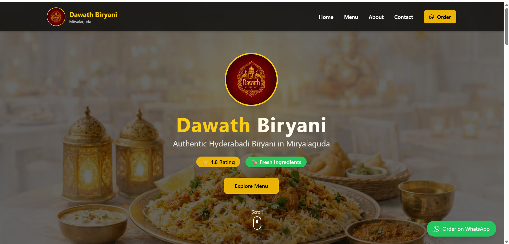
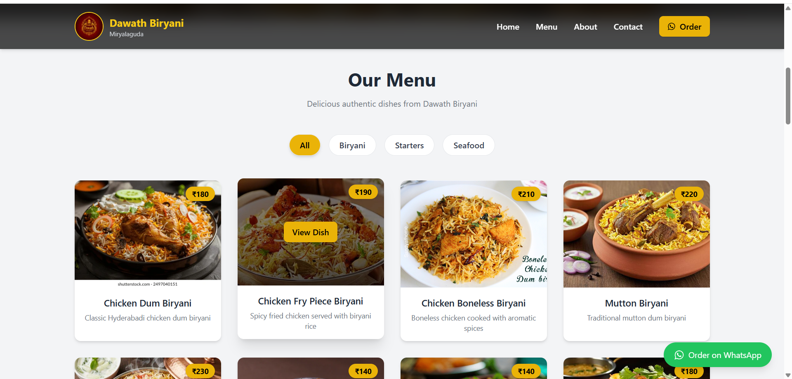
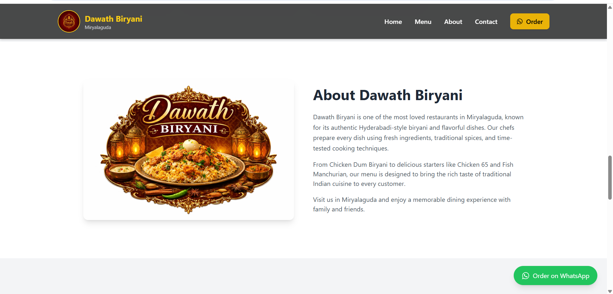
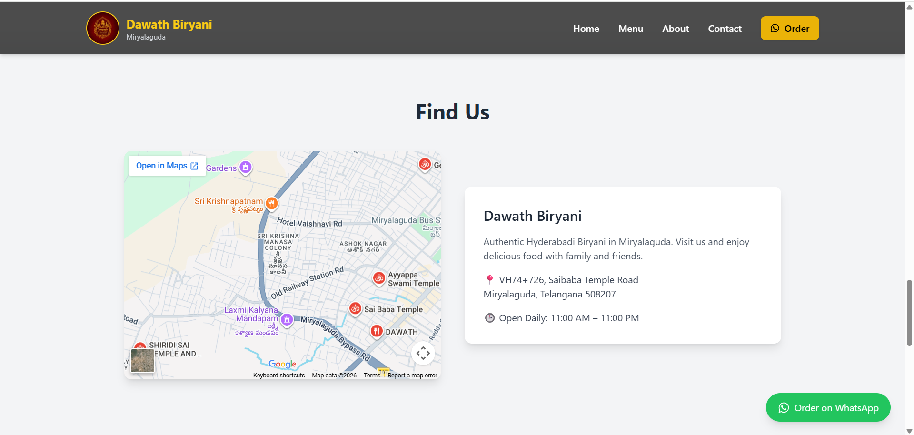
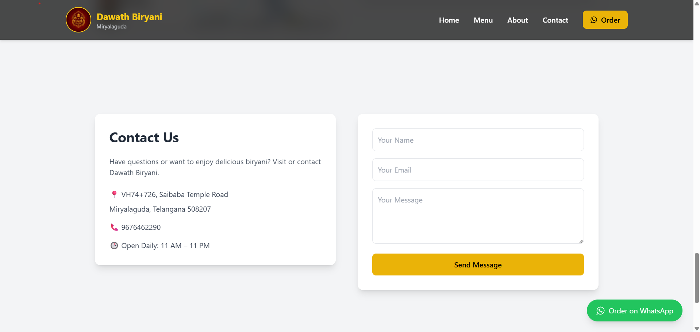

# 🍽️ Dawath Biryani – Restaurant Website


A modern **restaurant website** built for **Dawath Biryani in Miryalaguda** as part of the **Future Interns Full Stack Development Internship – Task 3**.

The website helps the restaurant:

- Look more professional online
- Display their menu attractively
- Allow customers to contact the restaurant
- Show location and business information
- Build trust with customers

---

# 🌐 Live Website

*(Add your deployed link here)*

Example:

```
https://dawath-biryani.vercel.app
```

---

# 🧾 About the Business

**Restaurant:** Dawath Biryani  
**Location:** Miryalaguda, Telangana  

Dawath Biryani is a popular local restaurant known for its authentic **Hyderabadi-style biryani** and delicious starters like **Chicken 65, Chilli Chicken, and Fish Manchurian**.

The goal of this project is to create a **modern website that helps the restaurant attract more customers and build a strong online presence**.

---

# ✨ Features

### 🏠 Hero Section
- Attractive landing section
- Restaurant logo with premium glow effect
- Restaurant tagline
- Smooth scroll indicator

### 🍗 Menu Section
- Interactive food menu
- Category filtering (Biryani / Starters / Seafood)
- Dish cards with images
- Dish detail popup (View Dish)

### 🧑‍🍳 About Section
- Restaurant story
- Restaurant image
- Information about the food and experience

### 📍 Location Section
- Embedded Google Maps
- Restaurant address
- Opening hours

### 📩 Contact Section
- Contact form
- Stores customer messages in database
- Success message after submission

### 📱 Responsive Design
- Fully mobile responsive
- Tablet and desktop friendly

---

# 🛠 Tech Stack

## Frontend
- React (Vite)
- Tailwind CSS
- Axios

## Backend
- Node.js
- Express.js

## Database
- MongoDB Atlas

---

# 📁 Project Structure

```
FUTURE_FS_02
│
├── backend
│   ├── server.js
│   ├── routes
│   │   └── contactRoutes.js
│   └── models
│       └── Contact.js
│
└── frontend
    ├── src
    │   ├── components
    │   │   ├── Navbar.jsx
    │   │   ├── Hero.jsx
    │   │   ├── Menu.jsx
    │   │   ├── About.jsx
    │   │   ├── Map.jsx
    │   │   ├── Contact.jsx
    │   │   └── Footer.jsx
    │   │
    │   ├── data
    │   │   └── menu.js
    │   │
    │   ├── App.jsx
    │   └── main.jsx
```

---

# ⚙ Installation

## 1️⃣ Clone Repository

```bash
git clone https://github.com/m-fani-goud/FUTURE_FS_02.git
cd FUTURE_FS_02
```

---

## 2️⃣ Install Backend Dependencies

```
cd backend
npm install
```

Start backend:

```
node server.js
```

Server runs on:

```
http://localhost:5000
```

---

## 3️⃣ Install Frontend Dependencies

```
cd frontend
npm install
npm run dev
```

Frontend runs on:

```
http://localhost:5173
```

---

# 📬 Contact Form API

```
POST /api/contact
```

Example request body:

```json
{
"name": "John",
"email": "john@gmail.com",
"message": "I want to order biryani"
}
```

The message is stored in **MongoDB Atlas**.

---

# 💡 Real World Value

This project demonstrates how developers can build websites for **local businesses**.

Such websites help businesses:

- Increase visibility
- Build trust
- Attract new customers
- Provide online information easily

This is how many developers start **freelancing and selling websites to local businesses**.

---

# 📸 Screenshots

### 🏠 Hero Section


### 🍗 Menu Section


### 🧑‍🍳 About Section


### 📍 Map Location


### 📩 Contact Section


# 📢 Internship Submission

This project was built for:

**Future Interns – Full Stack Web Development Internship**

Task: **Build, Pitch & Monetize a Real Local Business Website**

---

# 👨‍💻 Author

**Fani Mandala**

GitHub:  
https://github.com/m-fani-goud

---

# ⭐ If you like this project

Give it a ⭐ on GitHub!